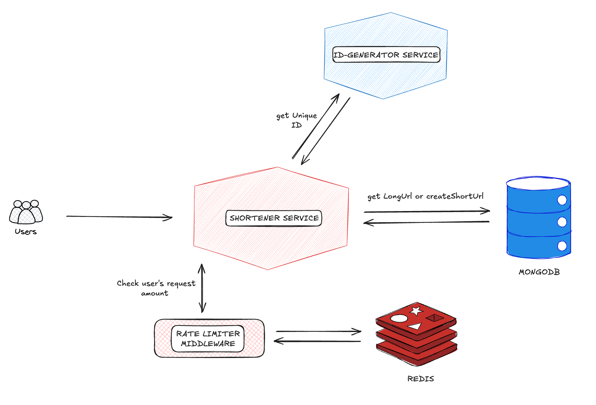

# URL Shortener Service

A high-performance URL shortening service built with Go, MongoDB, and Redis.

### Functional Requirements
- **Short URL Generation**: Generate a unique shorter alias for any given URL
- **Redirection**: Redirect users to the original URL when they access the short link
- **No Authentication Required**: Service is freely available to all users with rate limiting to prevent abuse

### Non-Functional Requirements
- **Scalability**: Horizontally scalable to handle increasing demand
- **Readability**: Short links are easily readable, distinguishable, and typeable (using Base-58 encoding to exclude confusing characters)
- **Performance**: High performance in URL redirection and shortening operations thanks to modern tech stack
- **Reliability**: Highly-available system with fault-tolerance
- **Security**: Rate limiting to prevent excessive access and abuse
- **Maintainability**: Services organized with N-Layer Architecture principles for easy maintenance
- **Low Latency**: Optimized for minimal latency to provide a smooth user experience
- **Unpredictability**: Short links are highly unpredictable (using Snowflake ID generation) to prevent URL guessing

## Technologies Used

- **Go (Golang)**: Primary programming language
- **MongoDB**: NoSQL database for efficient data storage and retrieval
- **Redis**: Used for rate limiting and caching access data

## API Endpoints

### Create Short URL
Creates a new short URL from the provided original URL.
Parameter: Original URL (`string`): The URL to be shortened
Return : Short URL (`string`): The new shortened URL

```
POST /shorten
```


### Redirect to Original URL
Retrieves the original URL from a given short URL and redirects the user.
Parameter: ShortUrl (`string`): Short Url
Return : Long Url (`string`): Long Url and redirect to website

```
GET /:shortUrl
```

## System Design Diagram




## Implementation Details

The URL shortener consists of two main services:

1. **ID Generator Service**: Generates unique IDs using Snowflake algorithm
   - Generated IDs are of type `uint64` and converted from Base10 to Base58
   - Base58 encoding excludes similar-looking characters (0, O, I, l) to improve readability

2. **Shortener Service**: Creates and manages short URL mappings
   - When a user submits a long URL, the system generates a unique ID and creates a short URL
   - When a user accesses a short URL, the system fetches the corresponding long URL and redirects

### Database Choice

We chose MongoDB (NoSQL) for the following reasons:
- Our system is read-heavy, making NoSQL databases a suitable choice
- MongoDB uses a leader-follower protocol, allowing the use of replicas for heavy reading
- It ensures atomicity in concurrent write operations
- Avoids collisions by returning duplicate-key errors for record duplication
- Performs better for read-intensive services compared to alternatives like Cassandra, Riak, and DynamoDB

### Security Measures

To prevent DoS attacks, the system implements rate limiting:
- Shortening URLs: Maximum of 20 requests per minute per IP address
- Redirections: Maximum of 75 requests per minute per IP address

Rate limiting is implemented using a rolling window strategy with Redis Sorted Set data structure, which provides better protection against quick bursts of traffic.

### Deployment

The service is containerized using Docker with a single binary, leveraging Golang's compilation capabilities.

## References

- [Educative - Grokking the System Design Interview: TinyURL](https://www.educative.io/courses/grokking-the-system-design-interview/requirements-of-tinyurls-design)
- [Karan Pratap Singh - System Design](https://github.com/karanpratapsingh/system-design?tab=readme-ov-file#url-shortener)
- Alex Xu - System Design Interview Book
-[Maurício Linhares - Rate Limiting in Go](https://mauricio.github.io/2021/12/30/rate-limiting-in-go.html)
